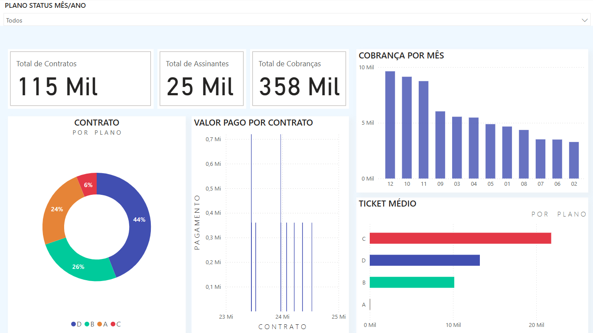

  

<h3 align="center">Olá! Eu sou Juliano Matheus Ferreira da Silva</h3>

Analista de Dados | MLOps | IA Generativa | Engenharia de Dados

---

## Projetos em Destaque

🔹 *[TETEU.IA](https://github.com/juliano1805/TETEU.IA)* – IA generativa aplicada a dados reais  
🔹 *[Pipeline MLOps – Themis](https://github.com/juliano1805/Pipeline-MLOPs-Themis)* – Deploy de modelo com CI/CD e monitoramento  
🔹 *[DataOps 360](https://github.com/juliano1805/DataOps360)* – Infraestrutura completa de dados com ingestão, transformação e visualização

---

## 💻 Preview

  

---

## 📊 Minhas Stacks

### 🧪 Linguagens & Ferramentas

  
  
  
  
  
  
  
  
  
  

### 🔎 Conceitos
ETL/ELT • MLOps • Engenharia de Dados • CI/CD • IA Generativa • DataOps • Observabilidade • Testes Automatizados

---

## 📚 Aprendizados Recentes

- 📦 Airflow para orquestração de pipelines  
- ☁ Monitoramento com Prometheus e Grafana  
- 🤖 Embedding de texto e classificação com LLMs  

---

## 📫 Entre em Contato

- ✉ julianomatheusferreira@gmail.com  
- 💼 [LinkedIn](https://www.linkedin.com/in/julianomatheusferreira)  
- 💻 [Meu Portfólio](https://juliano1805.github.io)  
- 🔢 

---

> ⭐ Este repositório serve como vitrine do meu portfólio. Explore os projetos e fique à vontade para entrar em contato!
